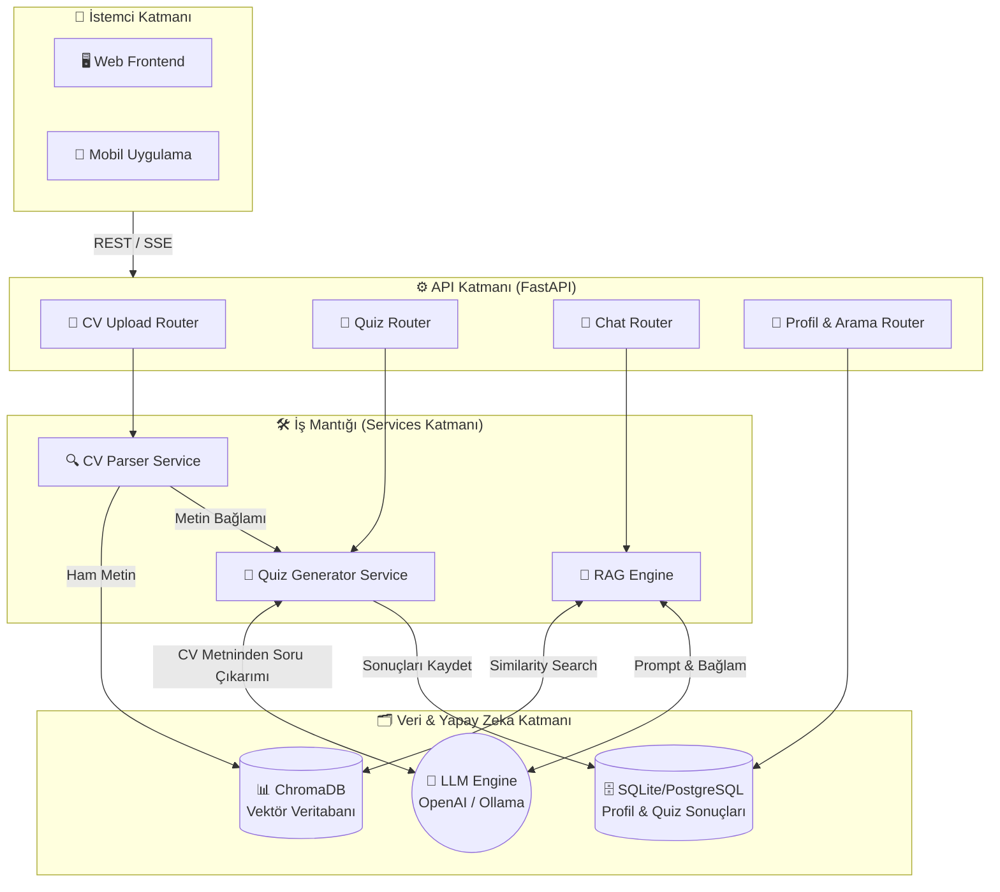
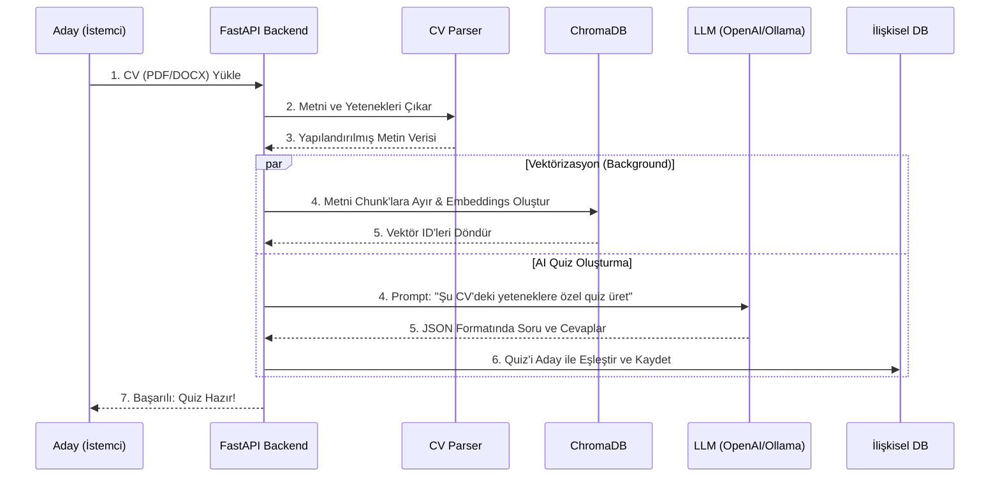
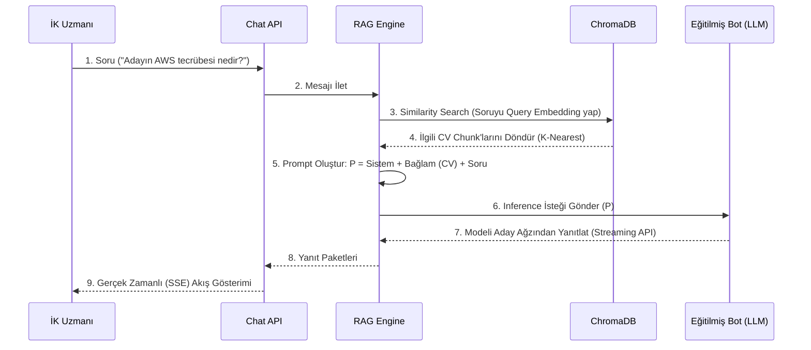

# 🏗️ RAG ve LLM Mimari Tasarımı

Bu doküman, sistemin RAG (Retrieval-Augmented Generation), Vector Database (Vektör Veritabanı) ve LLM (Büyük Dil Modeli) ile olan iletişim mimarisini detaylı olarak tasvir eder. Platform, CV üzerinden doğrudan teknik sınav (Quiz) oluşturma ve CV bağlamını temel alan Chatbot özelliklerine sahiptir.

## 1. Genel Sistem Akışı (System Flow)

Aşağıdaki şema, sistem bileşenlerinin ve veri tabanlarının (İlişkisel ve Vektör) birbiriyle olan bütünleşik mimarisini özetler.

---

## 2. CV Yükleme ve Quiz Oluşturma Akışı (Sequence Diagram)

Kullanıcı CV'sini yüklediğinde metin hem vektör veritabanına indekslenir, hem de adayın yetkinliklerini ölçecek olan özel quiz otomatikman LLM tarafından oluşturulur.

---

## 3. RAG Destekli İK Chatbot İletişim Akışı

İnsan Kaynakları Uzmanının, yüklenen CV verilerini kullanarak aday chatbot'una sorduğu soruların arkasında yatan Retrieval-Augmented Generation (Bağlam ile Güçlendirilmiş Üretim) akışı.

## 4. RAG Veri Mimarisi Parçalanma Stratejisi (Chunking Strategy)
- **Deneyim Bölümü:** Metinler projelere ve şirkette geçirilen sürelere göre paragraf bazlı kesilecektir.
- **Yetenekler Bölümü:** Tüm yetenekler bir metadata tag'i olarak veritabanına geçecek, vektör aramasında yüksek öncelik sağlanacaktır.
- **Eğitim Bölümü:** Okul ve dereceler küçük "chunk"lar halinde ayrıştırılacaktır.
- **Arama Stratejisi:** `top_k = 4` ayarı kullanılarak sorulan sorularla en çok eşleşen ilk 4 vektörel metin LLM'e bağlam (context) olarak beslenecektir.
